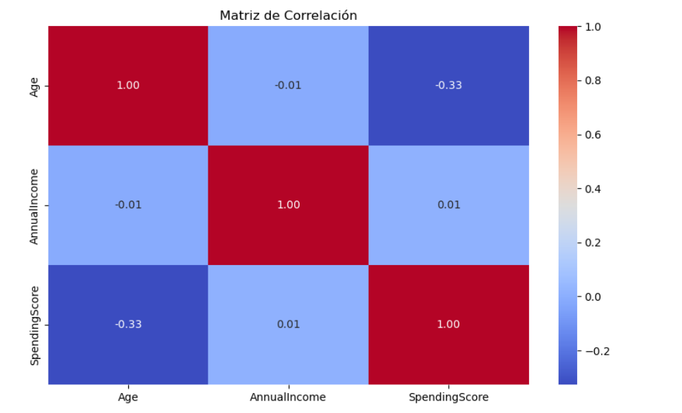
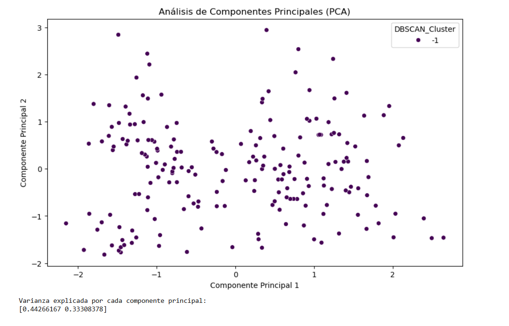
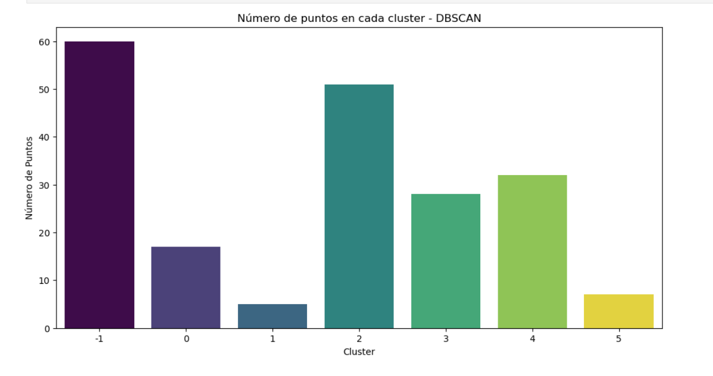
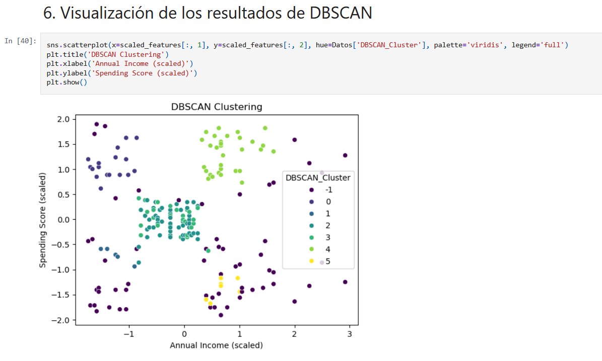

# Análisis y Segmentación de Clientes de Centros Comerciales

## Descripción

Este proyecto presenta un análisis exploratorio y de segmentación de clientes de centros comerciales utilizando técnicas de análisis de datos, visualización y aprendizaje automático.

El análisis busca identificar patrones en las características demográficas y de comportamiento de los clientes, con el propósito de obtener grupos de clientes con características similares.

## Objetivo

Analizar las características de los clientes de un centro comercial para identificar patrones y segmentos de comportamiento mediante técnicas de análisis de datos y clustering.

### Objetivos específicos

- Explorar y comprender el conjunto de datos.
- Analizar las características demográficas de los clientes.
- Examinar la relación entre ingresos anuales y comportamiento de gasto.
- Preparar los datos para el análisis.
- Identificar patrones y grupos de clientes.
- Utilizar técnicas de clustering para segmentar clientes.
- Aplicar técnicas de reducción de dimensionalidad.
- Representar visualmente los resultados.
- Interpretar los segmentos obtenidos.

## Dataset

El proyecto utiliza el conjunto de datos **Mall Customers**, obtenido de Kaggle.

El dataset contiene **200 registros y 5 variables**:

| Variable | Descripción |
|---|---|
| `CustomerID` | Identificador único del cliente |
| `Gender` | Género del cliente |
| `Age` | Edad del cliente |
| `Annual Income (k$)` | Ingreso anual en miles de dólares |
| `Spending Score (1-100)` | Puntuación de gasto asignada al cliente |

El archivo original utilizado en el proyecto se encuentra en:

`data/raw/Mall_Customers.csv`

## Metodología

El proyecto se desarrolla mediante las siguientes etapas:

### 1. Exploración de los datos

Se realiza una revisión inicial del conjunto de datos mediante:

- Visualización de los primeros registros.
- Información general de las variables.
- Estadísticas descriptivas.
- Revisión de tipos de datos.
- Análisis de las características de los clientes.

### 2. Preprocesamiento

Se realiza la preparación de los datos necesarios para continuar con el análisis y la segmentación de clientes.

### 3. Análisis exploratorio

Se estudian las principales características de los clientes y las relaciones entre variables como:

- Edad.
- Ingreso anual.
- Puntuación de gasto.
- Género.

### 4. Segmentación de clientes

Se aplican técnicas de clustering para identificar grupos de clientes con características similares.

Se utiliza **DBSCAN** como técnica de agrupamiento para identificar estructuras y patrones dentro de los datos.

### 5. Análisis de Componentes Principales

Se utiliza **PCA (Principal Component Analysis)** como técnica de reducción de dimensionalidad para facilitar la representación y análisis de los datos.

### 6. Evaluación y visualización

Los resultados obtenidos se representan mediante diferentes visualizaciones que permiten analizar:

- Relaciones entre variables.
- Componentes principales.
- Distribución de los clientes por cluster.
- Resultados de la segmentación mediante DBSCAN.

## Resultados

El análisis permite identificar diferentes patrones entre las características de los clientes, especialmente en relación con sus ingresos anuales y puntuación de gasto.

La aplicación de técnicas de clustering permite identificar grupos de clientes con características similares, mientras que PCA facilita la representación de los datos en un espacio de menor dimensionalidad.

Las visualizaciones generadas permiten interpretar los resultados de la segmentación y comprender mejor los diferentes perfiles presentes en el conjunto de datos.

Los resultados detallados y el desarrollo completo del análisis pueden consultarse en el notebook del proyecto.

## Visualizaciones

### Matriz de correlación

### Análisis de Componentes Principales

### Número de puntos por cluster

### Segmentación mediante DBSCAN

## Tecnologías utilizadas

- Python
- Jupyter Notebook
- Pandas
- NumPy
- Matplotlib
- Seaborn
- Scikit-learn

## Habilidades demostradas

- Análisis exploratorio de datos (EDA)
- Limpieza y preparación de datos
- Análisis de variables
- Visualización de datos
- Segmentación de clientes
- Machine Learning no supervisado
- Reducción de dimensionalidad
- Interpretación de resultados
- Python para análisis de datos

## Autor 

Sebastian Diaz 

Estudiante de ingenieria de sistemas 
